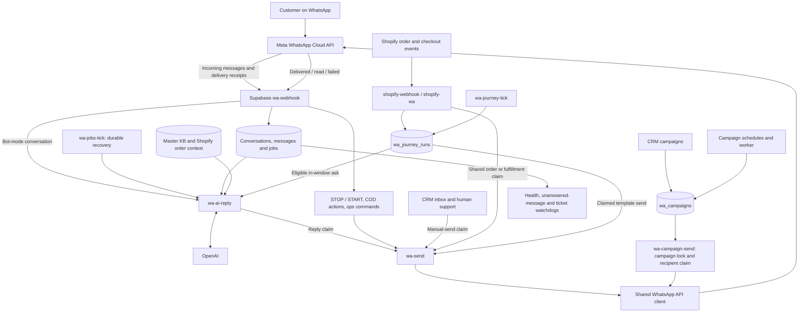

# PROMUNCH WhatsApp: current architecture and preservation baseline

Audit date: 12 September 2026. Purpose: understand and preserve the existing CRM customer flows before considering another integration. This is an architecture audit, not a migration or activation plan.

**Decision: keep the CRM as the existing sending system. Do not redirect its WhatsApp traffic to another platform as part of fixing marketing deliverability.** The requested storefront cart feature remains disabled, and the separate Relay sender remains prepared only.

## 1. The system in plain language

The CRM is the team's control panel. Supabase runs the chatbot, stores conversations and orders, and wakes scheduled workflows. Meta carries the WhatsApp messages and returns delivery receipts. Shopify supplies purchase and checkout events. OpenAI helps compose replies using the Master Knowledge Base and customer context.

There is more than one outbound workflow. They share data and transport helpers, but each must claim ownership of its message before sending. Preserving these claims is as important as preserving the webhook URL.

Arrows describe source-code responsibilities. They are not a claim that every branch was exercised in production during this audit.

## 2. Infrastructure and identity

| Component | Existing role and identity |
|---|---|
| CRM | Next.js dashboard and API routes on Vercel, `promunch-crm.vercel.app` |
| Supabase | Project `hlykspakpewuilttnydm`; Postgres, Auth, Storage, Edge Functions, pg_cron and Vault |
| WhatsApp account | PROMUNCH WABA `798547600007401` |
| WhatsApp sender | `+91 99813 10247`, phone-number ID `1106480032553084` |
| Business portfolio | PROMUNCH portfolio `141290440189538`; separate from the Relay platform's portfolio |
| Expected CRM inbound endpoint | `https://hlykspakpewuilttnydm.supabase.co/functions/v1/wa-webhook`; source-defined receiver, not a fresh export of all Meta subscription settings |
| Storefront | `https://promunch.in`, Shopify store `a1e4f4-2` |
| AI context | `kb_documents` / `kb_chunks`, conversation history, approved tools and order context |
| Credentials | Existing server-side Meta and Supabase credentials; never exposed to the storefront. No credentials are included in this document. |

The separate `relay.oltaflock.ai` OAuth callback and platform webhook belong to a different integration. Correcting those URLs does not establish a migration of this CRM's number, flows or history. Do not replace the CRM receiver with the Relay receiver without an explicit handover.

## 3. What happens when a customer messages

1. `wa-webhook` verifies the Meta request and inserts the provider message ID into the durable message ledger. The unique inbound ID is the first protection against webhook redelivery.
2. It updates the contact and conversation, handles supported media, and processes deterministic commands. Bare STOP unsubscribes; START opts back in. COD actions and internal ops completion commands have dedicated handling.
3. Eligible messages in a bot-mode thread create a durable `wa_jobs` entry before the fast attempt to call `wa-ai-reply`. The minute scheduler can recover queued work if the fast path fails.
4. `wa-ai-reply` reads the latest inbound message, conversation, KB and customer/order context. It can use approved tools and escalate an issue. Human-mode threads must remain under human control.
5. The reply-turn claim prevents the immediate attempt and the job retry from both answering the same inbound turn. A newer inbound message can supersede an older turn.
6. The answer goes through `wa-send`, which calls Meta and records the outbound result. Later Meta receipts update the ledger and feed campaign and journey failure handling.

Human agents use the CRM send API. It has a separate destination/content claim with a 90-second deduplication window. Draft generation and sending are separate actions.

## 4. Who owns each message

| Customer action / workflow | Owner and trigger | Duplicate protection to preserve |
|---|---|---|
| Chatbot answer | `wa-webhook` → durable job → `wa-ai-reply` | Inbound provider ID plus `claim_ai_reply` per thread/inbound turn |
| Human inbox reply or test send | `src/app/api/whatsapp/send/route.ts` → `wa-send` | `claim_manual_send`, destination/content hash, 90-second window |
| Order confirmation | Shopify event paths, job recovery and confirmation sweep converge on `_shared/order-confirmation.ts` | Shared order confirmation claim; never add an independent confirmation sender |
| Shipping update | `shopify-wa` fulfillment handler | `shipping_update:<order>:<fulfillment>` claim; Shopify order-status link |
| COD confirmation/reminder/escalation | Shared confirmation/COD gate and jobs tick | Per-order claims, reminder and ops-ping claims |
| Abandoned checkout | `shopify-wa` enrollment → `wa_journey_runs` → journey tick / in-window ask | Enrollment claims, atomic run claim, bounded cart template-attempt claim |
| Review / replenishment ask | Order enrollment → journey tick or eligible inbound piggyback | Shared ask/run claim so scheduled and inbound paths cannot both consume the same ask |
| Custom flow | Dashboard-defined trigger and `_shared/custom-flows.ts` | Per-flow/entity enrollment and journey execution claims; custom toggles are independent of built-in flow toggles |
| Marketing campaign | Worker/scheduler → `wa-campaign-send` | Campaign send lock plus queued `wa_messages` recipient claim, finalized in place |
| Support escalation | Thread/ticket state, ops notifications and watchdogs | Existing ticket state and notification claims; ops completion returns ownership appropriately |
| Requested storefront cart, currently off | Public cart endpoint → shopper sends request on WhatsApp → dedicated reply handler | Opaque expiring request, real inbound turn, mandatory claim and pre-send seal; no automatic send on button rendering |

**`wa-send` is not a universal deduplication barrier.** It dispatches and records results; callers own the message claim. Campaigns bypass `wa-send` and call the shared template transport directly. Wrapping only `wa-send` in a new sender would therefore miss campaigns and could change retry behavior elsewhere.

## 5. Live workflow settings

Read directly from `wa_flow_settings` during this audit. These override code defaults where present.

| Setting | Observed value |
|---|---|
| Order confirmations | Enabled |
| Shipping updates | Enabled |
| COD gate | Enabled; reminder 6 hours, needs-call escalation 24 hours |
| Abandoned cart | Enabled; configured steps at 1 and 6 hours; deadline 72 hours; backoff 6 hours |
| Cart coupon configuration | `PROMUNCH10` |
| Review request | Enabled, 14 days |
| Replenishment | Enabled, 30 days |
| First confirmation template | Stored null; source default is `order_confirmation_v2` |
| Repeat confirmation template | `order_confirmation_repeat_v1`, subject to approval/fallback checks |
| Automatic tagline switches | All four off; stored tagline empty |
| Voice rescue | Disabled |

Configured cart step times do **not** promise two marketing sends: current cart policy, claims, suppression, purchase state, service-window eligibility and expiry determine whether a step sends. The previously deployed cart delivery changes are part of this baseline; see [cart recovery delivery](../whatsapp/CART_RECOVERY_DELIVERY.md).

The requested storefront cart flag was off in the preceding rollout check, and the storefront embed was not installed. Neither was enabled during this audit. The follow-up live query returned zero custom flows. There are therefore no configured custom-flow rows in the current snapshot.

## 6. Scheduler baseline

Read-only `assistant_cron_status()` returned the following active schedules. At the snapshot, all listed frequent/daily jobs had a latest scheduler status of `succeeded`. The weekly summary had no run in the RPC's two-day lookback.

| Job | UTC schedule / cadence |
|---|---|
| `wa-jobs-tick` | Every minute |
| `wa-campaign-worker` | Every 2 minutes |
| `wa-unanswered` | Every 5 minutes |
| `wa-health` | Every 10 minutes |
| `wa-watchdog` | Minutes 5, 15, 25, 35, 45, 55 |
| `wa-journey-tick` | Every 15 minutes |
| `wa-confirmation-sweep` | Every 15 minutes |
| `wa-campaign-tick` | Every 15 minutes |
| `wa-ticket-watchdog-reping` | Every 15 minutes |
| `wa-rfm-tick-nightly` | 01:30 daily |
| `wa-ticket-watchdog-digest` | 03:30 daily |
| `wa-weekly-summary` | Monday 03:30 |
| `shopify-catalog-sync` | Every 30 minutes |
| `shopify-catalog-sync-nightly` | 19:30 daily |
| `shopify-webhooks-ensure` | 04:15 daily |
| `kb-embed-nightly` | 02:15 daily |

Latest frequent-job starts were around 06:45–06:57 UTC on 12 September. A successful pg_cron invocation is evidence that the schedule ran, **not proof that the downstream HTTP function succeeded or a customer received a message**. Check function events and delivery receipts for that.

Local `vercel.json` additionally contains `wa-watchdog` at 03:00 and 15:00 UTC and `wa-engagement-tiers` at 20:30 UTC. These are source configuration, not a fresh verification of the deployed Vercel scheduler. Keep the independent watchdog function of these jobs intact. Do not delete apparently overlapping jobs based on their names alone.

## 7. Data and trust boundaries

| Data | Why it matters |
|---|---|
| `wa_contacts` | WhatsApp identity, consent and segmentation; imported purchase phones are not a blanket marketing audience |
| `wa_threads` | Conversation ownership and support/ticket state |
| `wa_messages` | Incoming/outgoing ledger, campaign recipient claims, errors and delivery states |
| `wa_jobs` / `wa_reply_claims` | Durable reply recovery and per-inbound ownership |
| `wa_confirmation_claims` | Shared per-entity send ownership, including cart template-attempt keys |
| `wa_journey_runs` / `wa_flow_settings` / `wa_custom_flows` | Scheduled actions, built-in controls and custom automation |
| `wa_campaigns` / `wa_templates` | Campaign lifecycle, send locks, template state and parameters |
| `wa_marketing_suppression` | Recipient-level marketing stand-down decisions |
| `shopify_orders` | Real order source; WhatsApp matching uses `customer_phone = wa_id`, not a nonexistent order `contact_id` |
| `kb_documents` / `kb_chunks` | Master knowledge and retrieval; preserve product facts and policies |
| `wa_short_links` / `wa_link_clicks` | Recovery/request links and attribution |
| `connector_events` | Operational evidence and failure alerts |

Dashboard routes use Supabase session authentication. Public webhook routes must verify provider signatures; cron/internal functions use their own server authentication. Disabling gateway JWT validation is not permission to remove internal authentication. Credentials in Vercel, Edge Functions and Vault are distinct configuration surfaces and must remain consistent.

`sent` means API acceptance; `delivered` and `read` are stronger evidence of reach. A delayed failure callback can arrive after an apparently successful send. Preserve callback handling as well as outbound requests. GDPR-anonymized records must remain anonymized.

## 8. Findings that constrain future changes

1. **The existing system is broader than the chatbot.** Replacing its receiver or sender can affect COD, order updates, support, campaigns and scheduled asks together. A second platform must not independently answer the same number.
2. **There are source-level deduplication weaknesses to review separately.** The ordinary AI claim helper falls back to a non-atomic read if its RPC errors. The manual-send route also proceeds on claim RPC errors. These are observed code paths, not proof that the production RPCs are currently failing. They weaken a blanket “duplicates are impossible” claim. No behavior was changed in this audit.
3. **Recovery links need special care.** Existing checkout code prefers the checkout partner URL in the NOTE, but still falls back to Shopify's `abandoned_checkout_url` if the note is absent. The source itself explains that the partner checkout may make that fallback unusable. Preserve the working partner URL and explicitly validate missing-note cases before changing cart flows.
4. **Built-in switches do not govern every custom flow.** Custom enrollment can run independently of the built-in shipping/cart toggle. Review custom definitions before claiming a channel or trigger is fully paused.
5. **The Meta UI showed “AI active” on the production account.** Whether a separate Meta agent actually sends replies was not established. Treat this as an unresolved ownership check, not proof of duplicate replies. Do not disable it blindly.
6. **Historical docs contain drift.** The live review delay is 14 days, COD is enabled, and current scheduler entries differ from older topology descriptions. Old campaign handoff instructions are historical context, not authorization to restart a cancelled campaign.
7. **Marketing failures are not evidence that every CRM flow is broken.** Earlier delivery analysis showed failures concentrated in marketing, particularly error 131049, while service and utility traffic had substantially better reach. Account ownership and OAuth configuration are separate concerns. Moving the account or receiver has not been demonstrated to fix those failures.

## 9. Evidence limits and preservation checklist

This audit read current source and live workflow/scheduler settings. Earlier checks in this task verified the production phone as connected with high quality, the correct PROMUNCH account identity, and working CRM access. It did not send test messages, replay webhooks, alter customer records, inspect every custom journey, or compare every deployed function byte-for-byte with local source.

Before any later rollout, retain this baseline and verify the following using an explicitly approved test number and controlled test fixtures:

- Inbound text produces one KB-grounded response; duplicate webhook delivery produces no extra response.
- STOP bypasses AI; START restores consent appropriately; human mode prevents bot takeover.
- An interrupted reply job recovers once; a newer inbound turn supersedes the older one.
- Duplicate Shopify events yield one order confirmation and one update per fulfillment.
- COD confirmation, reminder, escalation and ops completion preserve their existing state transitions.
- Purchased/expired/suppressed carts are skipped; partner recovery links restore the right cart.
- Campaign and in-window journey sends retain their own claims and delivery callback accounting.
- No second sender owns the same conversation, and disabling a new feature leaves existing workflows running.

No production settings, webhook subscriptions, templates, schedules, functions, customer messages or storefront code were changed by this architecture audit. The result is a documented baseline, not a certification that all edge cases are healthy.

## 10. Source guide

Paths below are relative to the repository root:

- Inbound: `promunch-email-agent/supabase/functions/wa-webhook/index.ts`
- Reply orchestration: `promunch-email-agent/supabase/functions/wa-ai-reply/index.ts`, `turn-claim.ts`, `cart-request.ts`, `asks.ts`
- Transport: `promunch-email-agent/supabase/functions/wa-send/index.ts`, `_shared/whatsapp.ts`
- Manual send: `src/app/api/whatsapp/send/route.ts`
- Shopify: `promunch-email-agent/supabase/functions/shopify-wa/index.ts`, `shopify-webhook/index.ts`, `_shared/order-confirmation.ts`, `_shared/cod-gate.ts`
- Journeys: `promunch-email-agent/supabase/functions/wa-journey-tick/index.ts`, `_shared/window-asks.ts`, `_shared/cart-recovery-policy.ts`, `_shared/flow-settings.ts`, `_shared/custom-flows.ts`
- Campaigns: `promunch-email-agent/supabase/functions/wa-campaign-send/index.ts`, `wa-campaign-worker/index.ts`
- Marketing eligibility: `promunch-email-agent/supabase/functions/_shared/marketing-governor.ts`, `_shared/wa-quota.ts`
- Cron readout definition: `promunch-email-agent/supabase/migrations/20260820070000_io_retention.sql`
- Application schedules: `vercel.json`
- Existing rollout record: [CART_RECOVERY_DELIVERY.md](../whatsapp/CART_RECOVERY_DELIVERY.md)

## 11. Follow-up live preservation check

Read-only checks on 12 September 2026 narrowed the outstanding questions:

- The live REST schema exposes `claim_ai_reply`, `mark_ai_reply_sent`, `claim_manual_send` and `claim_order_confirmation`. None was invoked by this check. Interface presence does not prove every function implementation or database constraint matches local source.
- The latest 100 reply-claim records all have status `sent`; the newest was claimed at 07:02:10 UTC. This supports actual use of the claim mechanism rather than merely its presence.
- The latest 100 job records all have status `done`; the newest was created at 07:02:03 UTC. This is a recent sample, not an exhaustive backlog audit.
- The manual-send claim table contains 19 sampled records, most recently dated 5 September.
- `wa_custom_flows` returned zero rows.
- Meta still shows the production number connected with high quality. The separate Meta Business Agent configuration could not be verified from the accessible view; no setting was changed.

### Recent delivery sample

Latest 200 outbound ledger rows, spanning 5 September 05:42 UTC to 12 September 07:30 UTC. This includes customer and internal ops messages and is not a campaign-wide delivery-rate calculation. Reached means delivered or read; pending means status sent.

| Workflow | Reached | Pending | Failed | Failures attributed to 131049 |
|---|---:|---:|---:|---:|
| Bot replies | 46 | 2 | 0 | 0 |
| Order confirmations | 7 | 2 | 1 | 0 |
| Shipping updates | 12 | 1 | 1 | 0 |
| Abandoned checkout | 0 | 0 | 4 | 4 |
| Review requests | 7 | 0 | 16 | 16 |
| Replenishment reminders | 20 | 1 | 24 | 19 |

Across all 200 rows: 147 delivered/read, 6 sent, 47 failed. Of those failures, 39 contain error 131049 or its healthy-ecosystem explanation. The other eight errors need separate classification. The table above shows selected customer workflows, so its totals differ from the full sample.

**Operational conclusion:** recent evidence supports preserving the existing chatbot and transactional paths. Cart recovery is failing in this sample at the marketing-delivery boundary. No account migration or chatbot replacement is justified by these observations. The sample does not establish that the four cart failures happened after the latest deployment or that every historical failure has the same cause.

Next controlled verification remains an explicitly approved test on a known number, including duplicate webhook handling and a shopper-requested cart response. The prepared cart feature and separate sender remain off. This follow-up made no production writes and sent no messages.
