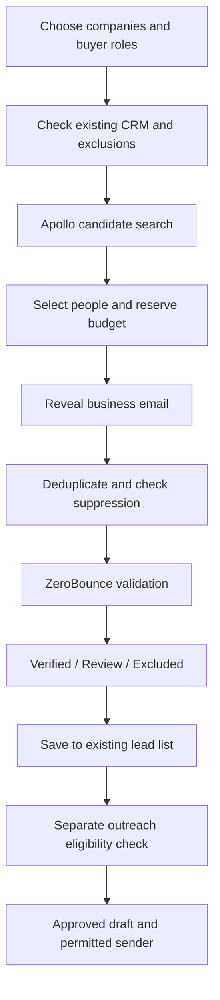

# PROMUNCH Buyer Finder
## Complete product, backend, API and rollout plan

**Prepared:** 15 September 2026  
**Status:** Proposal for setup and implementation. No accounts purchased, contacts fetched, emails sent, application code changed or deployment performed.  
**Recommended location:** B2B Leads → Find buyers.  
**Recommended stack:** Apollo for people discovery, ZeroBounce for independent email validation, existing Next.js + Supabase for the product. Hunter is an optional fallback after the pilot.

## 1. Decision in one page

Build a **Find buyers** tab inside the existing B2B Leads module. A user chooses an industry, location and buying purpose, reviews matching companies, and clicks **Find verified emails** for selected buyers. The app saves named contacts, their roles, business emails, verification dates and evidence to existing lead lists.

Start with Indian pharmaceutical companies buying snacks for employees, onboarding, office pantries and internal events. Expand to IT services, manufacturers, professional services, coworking operators and corporate gifting agencies using the same workflow.

The backend should:

1. Identify relevant companies and likely buying roles through Apollo.
2. Reveal emails only for selected people, controlling paid credits.
3. Independently validate each returned email through ZeroBounce.
4. Exclude risky addresses, duplicates and previously unsubscribed contacts.
5. Save results into the current CRM, with a separate eligibility check before any outreach.

**Budget recommendation:** Allocate **US$100–150 for the first paid discovery pilot**, excluding development, taxes and any mailbox changes. This is a planning allowance, not a confirmed vendor quote. Test API access and coverage first. Do not prepay an annual plan just to validate the concept.

**Delivery estimate:** 10–15 working days for a production-ready discovery feature and the integration safeguards described here, assuming provider access is available. Allow another 1–2 weeks of pilot observation. Sending changes can take longer if sender authorization or inbound event handling needs work.

**What we can promise:** Every green result has a dated mailbox validation, a documented buyer role and a clear reason for eligibility. **What we cannot promise:** every decision maker in every company, zero bounces, inbox placement, or zero unsubscribes. A valid mailbox does not establish purchasing authority, interest or permission to contact.

## 2. What already exists and what must change

This proposal is grounded in the local repository, not a production-account audit.

| Existing component | Finding | Proposed treatment |
|---|---|---|
| `src/app/dashboard/leads/page.tsx` | B2B Leads has lists, sequences, templates, replies and analytics, plus Find companies | Add Find buyers here; preserve existing navigation |
| `src/lib/leads/engine.ts` | Company discovery, crawling, contact selection and pipeline work | Reuse companies/lists, but keep paid discovery in a durable job queue |
| `src/lib/leads/enrich-company.ts` | AI suggests the likely decision-making role from company evidence | Retain as a supporting explanation; it does not identify a real person |
| `src/lib/leads/mx.ts` | Syntax and domain mail-server checks only | Keep cheap checks, but never label `mx_ok` as mailbox verified |
| `lead_contacts` | Stores email, role hint, source and basic verification | Extend with person identity, provider provenance and independent verification |
| `outreach_drafts`, `outreach_events`, `suppressions` | Existing drafting and outreach history | Reuse, strengthening shared eligibility and duplicate prevention |
| Manual send route and `sequence-engine.ts` | Both call Resend | Block newly discovered cold prospects from this transport |
| Edge function `b2b-send` | Gmail helper exists | Not evidence of an active or correctly configured B2B sending path |

The Gmail helper currently sends from its configured `MAILBOX`; changing only its display name would not establish `parth@trypromunch.in` as the sender. Sender identity and reply routing must be checked before reuse.

Resend explicitly disallows unsolicited outreach and requires opt-in recipients. Accordingly, discovery must not silently enroll newly sourced contacts into existing sends. [Resend acceptable-use policy](https://resend.com/legal/acceptable-use)

## 3. Who we should find

Search for the person responsible for the buying occasion, rather than automatically targeting the CEO.

| Segment / buying purpose | Primary roles | Secondary roles |
|---|---|---|
| Pharma employee gifting and wellness | HR Head, Employee Engagement, Total Rewards | Administration, indirect procurement |
| Pharma office pantry and internal events | Administration Head, Facilities, workplace services | Procurement or purchase manager |
| IT and professional services | People Operations, HR, workplace experience | Admin and procurement |
| Manufacturing employee programmes | Plant HR, corporate HR, administration | Indirect procurement |
| Corporate gifting agencies | Founder, sourcing head, category manager | Partnerships and procurement |
| Smaller businesses | Founder or operations head | HR or office manager |

**Initial preset:** India; pharma; employee gifting; 100+ employees; HR/Admin/Procurement; maximum three candidates per company. Locations are optional. Search employer geography separately from a person's location, since an India buyer can work for an overseas-headquartered group.

For pharma, focus the initial use cases on employees and internal business needs. Do not automatically pitch gifts for doctors or healthcare professionals: pharmaceutical marketing rules specifically address gifts to healthcare professionals. Any such enquiry needs separate review. [Department of Pharmaceuticals, UCPMP](https://pharma-dept.gov.in/policy/uniform-code-pharmaceutical-marketing-practices-ucpmp-2024-reg)

**Role fit is an estimate.** Display “Likely buyer: HR leadership” and its evidence; only mark purchasing responsibility as confirmed after a human confirms it or the buyer replies.

## 4. The user experience

### Main flow

1. Open **B2B Leads → Find buyers**.
2. Choose a preset such as **Pharma employee gifting**, or select industry, region, company size and buying purpose.
3. Click **Find companies**. Also support pasted company websites and a CSV of company names/domains.
4. Select relevant companies and review candidate job titles. Search previews may contain incomplete names; do not invent missing identity fields.
5. Click **Find verified emails**. Show the maximum credits this action can use before it starts.
6. Results appear progressively. The user can leave the page and return without losing progress.
7. Click **Save verified buyers to list**. Outreach is a separate action with its own checks.

**Company detail:** Add a **Find decision makers** button to existing leads so the team can enrich companies already in the CRM.

### Result table

Show Company, Person, Current role, Buying purpose, Work email, Email status, Last checked, and Action. Put provider name, source details and job history in the contact drawer. Show a human-readable reason whenever a result is excluded.

Use these status labels:

- **Verified email:** passes the current mailbox policy.
- **Needs review:** catch-all, role conflict, stale employment or uncertain identity.
- **Not found:** no named business address returned.
- **Do not contact:** unsubscribe, complaint, invalid address or other suppression.
- **Recheck required:** previously valid but outside the freshness window.

Keep a separate **Outreach eligibility** field. “Verified email” must never visually imply consent.

### Simple controls

Default to three candidate buyers per company and one initial recipient per company when outreach is permitted. Advanced controls can reveal more stakeholders, with a visible cost estimate. Show “23 companies searched; 41 candidates; 26 verified; 9 uncertain; 6 not found” instead of a misleading success percentage.

Include loading, partial progress, no matches, provider unavailable, access denied and out-of-credits states. API errors must not look like empty search results. Use the existing `pm-` components and dashboard data-fetch conventions.

## 5. API selection

| Option | Role in this proposal | Why / limitation |
|---|---|---|
| **Apollo** | Primary company and person discovery, then email reveal | Provides role/company filtering and person enrichment. Actual India pharma coverage needs measurement |
| **ZeroBounce** | Independent mailbox validation | Returns explicit validity and risk signals. Does not confirm the buyer's job or guarantee delivery |
| **Hunter** | Optional recovery for known full name + company domain | Useful when Apollo misses an email; extra provider complexity and spending should earn their place |
| Existing web research + MX checks | Supporting company evidence and cheap preliminary checks | Insufficient for finding and verifying named buyers on its own |

### Apollo integration

Use `POST /api/v1/mixed_people/api_search` for candidate discovery. This endpoint currently costs zero credits and does not return email addresses. Use company domains, role titles, seniority and geography filters; account-specific access must be tested. [Apollo People API Search](https://docs.apollo.io/reference/people-api-search)

Use `POST /api/v1/people/match` for selected people, using their provider IDs, or bulk enrichment in groups of up to ten. Do not request personal emails, mobile numbers or paid waterfall enrichment by default. These are unnecessary for this feature. [Apollo people enrichment](https://docs.apollo.io/docs/enrich-people-data)

Budget using the current endpoint tariff: standard people enrichment can consume one credit for demographic/email data, while phone and waterfall options can cost substantially more. Organization search is separately charged per page. Test actual credit deltas before scaling. [Apollo API pricing](https://docs.apollo.io/docs/api-pricing)

Industry discovery should first resolve matching organizations through the documented organization search endpoint, then search people by selected organization IDs/domains. Pin the request schema from the current provider documentation during integration rather than guessing filter IDs. For pasted domains, skip paid company enrichment unless missing company information is required.

### ZeroBounce integration

Use `POST https://api.zerobounce.net/v2/validate` with a form-encoded body containing the email and API key. Normalize `status`, `sub_status`, `free_email`, `catchall_domain` and the processing time. Calls can be slow, so run them in background jobs. Unknown results are not charged according to its current documentation. [ZeroBounce validation API](https://www.zerobounce.net/docs/email-validation-api-quickstart/v2-validate-emails)

### Hunter fallback

Use `GET /v2/email-finder` with a confirmed name and company domain, followed by the same independent validation. Retain whether the address was found or inferred. If the data-use policy requires only published addresses, use `/v2/email-finder/found`. Mask query strings in logs because this API carries its key in request parameters. [Hunter API](https://hunter.io/api-documentation/v2)

**Selection rule:** Launch with two providers. Add Hunter only if a controlled test materially increases verified, relevant buyers at an acceptable incremental cost. Do not chain multiple providers against already invalid or suppressed addresses just to obtain a green result.

## 6. Backend workflow

### Durable background jobs

The browser submits a job and receives `202` plus a job ID. A Supabase worker processes bounded batches, with pg_cron waking it every minute. No new sub-daily Vercel cron. Use the project's Vault-backed internal-auth pattern.

Each job stores its filters, selected IDs, cursor, status, attempts, lease expiry, progress counts, reserved budget and actual spend. Claim jobs atomically. A worker crash resumes from the last persisted item; reopening the page never restarts a paid search.

Deduplicate paid work by provider + person/email + operation + freshness window. A double-click reuses the same job. Maintain a provider-request ledger before making external calls. For ambiguous paid-call timeouts, record “cost uncertain” and reconcile before retrying where possible; provider calls cannot be assumed exactly-once.

Retry transient failures with bounded exponential backoff and jitter. Respect `Retry-After`. Invalid keys, forbidden access and exhausted balances pause the provider, not every individual contact. Default worker concurrency is small and tuned during the pilot. Store partial success and allow cancellation of unstarted work.

### Avoid unnecessary calls

- Reuse a current person/company result for 30 days, subject to vendor retention terms.
- Reuse mailbox verification for seven days for outreach eligibility; recheck only when needed.
- Check known suppression before paid lookup wherever identity is available, and again after email reveal.
- Cap company-search pages, selected candidates and verification retries per job.
- Never automatically reveal every match across an entire industry.
- Treat no-result and uncertain-result counts as useful outcomes, not errors to retry endlessly.

These windows are proposed product defaults, not provider guarantees.

## 7. Data model and app interfaces

### Extend existing records

**`leads`:** provider organization ID, normalized company domain, industry, employee band, group/company relationship and last company check. Do not collapse separately purchased business units solely because they share a domain.

**`lead_contacts`:** person ID/provider, full name, current title, department, seniority, profile/source references, employment check date, email source, mailbox status/substatus, risk flags, verification provider/time/expiry, buyer-fit explanation, eligibility status/reasons and outreach basis.

Keep the old `verify_status` for compatibility as a domain-check field. Add a separate `mailbox_status`. Existing `mx_ok` contacts do not get promoted to verified during migration.

### New supporting tables

| Table | Purpose / key constraints |
|---|---|
| `buyer_discovery_jobs` | Durable queue, cursor, lease, creator, filters and budget; unique client idempotency key |
| `buyer_discovery_items` | Candidate outcome per job/provider person; unique combination prevents duplicate processing |
| `email_verifications` | Dated verification history by normalized email; deduplicate the request key |
| `provider_usage_events` | Operation, estimated/reserved/actual credits, provider request reference and reconciliation state |
| `outreach_send_ledger` | Shared durable delivery attempt keyed to recipient, outreach programme and step |

Reuse `suppressions`; extend it if necessary for domain-wide do-not-contact requests and provenance. Apply suppression globally across lists, imports and send paths. Add a normalized-email identity index so an email attached to two companies cannot bypass deduplication. Do not remove Gmail dots or plus suffixes globally.

### Proposed routes

- `POST /api/leads/buyers/search`: paginated candidate/company search.
- `POST /api/leads/buyers/jobs`: select candidates, reserve credits and start reveal/validation.
- `GET /api/leads/buyers/jobs/:id`: status and paginated results.
- `POST /api/leads/buyers/jobs/:id/cancel`: cancel pending work.
- `POST /api/leads/buyers/save`: link accepted candidates to existing leads/lists.
- `POST /api/leads/:id/find-buyers`: run discovery for an existing company.
- `POST /api/leads/contacts/:id/reverify`: refresh a stale check.
- `GET /api/leads/buyers/usage`: remaining configured budget and actual usage.

Use authenticated routes, validated input, explicit staff authorization and audit records. Owner/admin controls budget; only the existing secrets owner can edit API keys. Keep keys in `app_secrets` through `getSecret()`. Never expose provider credentials or raw errors in the browser.

New tables require RLS, no anonymous access, and server-only writes. Contact exports require authorization and audit. Retain minimal normalized data and provenance; discard unnecessary raw provider fields. Honour existing anonymization and deletion rules, retaining only the minimal suppression evidence needed to prevent re-import and re-contact. Proposed default: purge unselected candidate data after 30 days and review inactive saved prospects after 180 days, subject to contractual and legal requirements.

## 8. What “verified” means

Default acceptance policy:

1. Non-null, well-formed business email.
2. Independent validator says `valid`.
3. No catch-all/accept-all indication, including a risk flag that accompanies a valid status.
4. No disposable, role-based, spam-trap, abuse, toxic or do-not-mail indication.
5. Person and current employer match the target company/domain or an evidenced group domain.
6. Verification is within seven days when preparing outreach.
7. No global suppression or anonymization conflict.

Unknown and catch-all addresses stay in review. Permit at most one delayed recheck for a temporary validation problem; do not repeatedly probe them. Missing/contradictory provider fields fail closed into review.

Mailbox checks do not prove current employment. Store identity and mailbox evidence separately. A company's server may accept mail for every possible address, and people change roles. Show verification dates and refresh the employment match when evidence is stale or inconsistent.

## 9. Deliverability and unsubscribes

### Sending policy

Discovery and saving do not send anything. Initially allow research, lists and draft preparation. Before enabling outreach, establish the contact basis, provider permission, sender identity and event handling.

- Existing Resend sends remain suitable only for contacts meeting its opt-in policy.
- Gmail API is the proposed path for individually reviewed, permissible business correspondence if the actual mailbox and intended usage qualify. Google prohibits unsolicited mass email; using its API does not create an exemption. [Google Workspace acceptable-use policy](https://workspace.google.com/terms/use_policy/)
- If the intended campaign does not meet the sender's policy, leave sending disabled and use permission acquisition or a provider contract explicitly supporting that use. Do not automatically switch transports after a rejection.
- Sender remains **Parth, founder, `parth@trypromunch.in`**, with matching reply-to, driven by `outreach_settings`. Verify the mailbox/send-as authority and inbound processing.

A different mailbox on the same domain does not isolate domain reputation. The required sender shares `trypromunch.in` with other traffic, so any future domain-separation decision needs an explicit sender-policy change.

### Technical protections

Validate SPF, DKIM, DMARC alignment and reply handling. Use plain, relevant messages grounded in the Master KB. No medical claims or invented company facts. No fake reply subjects. Avoid attachments in first contact; provide a catalogue when requested.

Include a visible opt-out and appropriate unsubscribe headers. A signed opaque unsubscribe token must work without login. One-click POST applies suppression immediately; a normal GET link should display a confirmation page to avoid automated link scanners unsubscribing people accidentally.

Unsubscribe replies, hard bounces and complaints immediately suppress the address and cancel pending outreach across all lists. Any reply stops the automated sequence; a human decides what comes next. A request to stop contacting the whole company also creates a domain exclusion.

For a permitted pilot, propose 10–20 total messages per business day, including follow-ups, with a single shared atomic cap. This is an operational starting limit, not a guarantee or a policy exemption. Default to one recipient per company and at most one relevant follow-up after 5–7 business days. Do not re-enroll an unresponsive person in another list to restart the sequence.

**Internal stop rules:** pause the pilot on any known spam complaint or two hard bounces in its first 100 sends. After that, pause on a hard-bounce rate of 2% or more over the latest 100 attempts. Review targeting if opt-outs reach 2% over that sample. These conservative product thresholds are distinct from provider metrics. Google recommends reported spam below 0.1% and avoiding 0.3% or higher. [Google sender guidance](https://support.google.com/mail/answer/14229414?hl=en)

### Avoid duplicate sends

All send entry points must call one shared eligibility gate and ledger. Reserve the message and daily budget atomically before the external call. Use a unique recipient/programme/step key and provider idempotency where supported. A timeout after submission becomes **delivery uncertain**, not a fresh retry. Reconcile provider history before retrying; ambiguous Gmail submissions require review because a local claim cannot guarantee external exactly-once delivery.

Perform a final suppression and reply check immediately before dispatch, coordinated with cancellation. Already submitted messages cannot be recalled by an unsubscribe arriving afterward.

### Measure what is observable

A Gmail send response means submitted, not delivered or read. Implement Gmail reply and delivery-failure ingestion with deduplication and message/thread correlation before Gmail sending is enabled. Do not expect Resend webhooks to report Gmail outcomes. Gmail does not provide universal recipient-level spam-complaint or inbox-placement feedback; missing events cannot be presented as zero complaints or perfect delivery. Postmaster data may be unavailable at low volumes.

## 10. Cost model

Prices below were researched on 15 September 2026. Vendor pages and account entitlements can differ. Reconfirm checkout, billing cycle and actual API usage before purchase.

| Component | Public pricing evidence | Planning treatment |
|---|---|---|
| Apollo Basic | Advertised at $49/seat/month billed annually, with 30,000 annual credits in current vendor material | $588 annual commitment, not a $49 cancellable month. Confirm API access and a monthly quote |
| ZeroBounce validation | Minimum pay-as-you-go purchase: $39 for 2,000 validations | Use $0.0195/check as a conservative small-pack calculation; cash purchase happens upfront |
| Hunter optional | Starter displayed at $34/month billed annually ($408/year); 24,000 annual credits | Do not buy initially. A separate API-only credit offering also exists |
| Existing app/database | Reuse current infrastructure | No new service required by design; monitor actual database/function usage |
| Sending / mailbox | Depends on mailbox availability and permitted transport | Excluded from discovery budget; obtain a quote only if required |

Sources: [Apollo vendor pricing summary](https://www.apollo.io/insights/apollo-vs-smartlead), [Apollo pricing and terms](https://www.apollo.io/pricing), [ZeroBounce pricing](https://www.zerobounce.net/pricing), [Hunter pricing](https://hunter.io/pricing).

### Worked monthly planning scenarios

Assumptions, not measured conversion rates: 80% of selected candidates yield a business email; 80% of those pass independent verification and role review. Reserve 20% additional validation calls for freshness rechecks. These calculations assume sufficient Apollo credits and use $49 as the annualized monthly allocation.

| Selected candidates | Emails returned | Usable verified buyers | Checks including reserve | Validation allocation | Apollo + validation allocation | Cost per usable buyer |
|---:|---:|---:|---:|---:|---:|---:|
| 250 | 200 | 160 | 240 | $4.68 | $53.68 | $0.34 |
| 1,000 | 800 | 640 | 960 | $18.72 | $67.72 | $0.11 |
| 2,000 | 1,600 | 1,280 | 1,920 | $37.44 | $86.44 | $0.07 |

These are **allocated costs**, not monthly invoices. Buying Apollo annually plus the minimum verifier pack would require **$627 upfront**, before tax. A monthly Apollo purchase would change the allocation and upfront amount; its live quote is unresolved. Organization-search credits, enrichment without email, taxes, currency conversion, infrastructure overages, Hunter, implementation and sending are not included in these example totals. Avoid promising that annual credits support sustained monthly usage until the complete credit ledger is measured.

At only 50% usable yield, the 1,000-candidate example costs approximately $0.14 per usable buyer using the same $67.72 numerator. Yield matters more than a vendor's advertised database size.

**Pilot allowance:** $100–150 assumes a suitable monthly discovery plan is available, one $39 verifier pack and headroom. If the actual quote exceeds that allowance, keep the provider trial and smaller sample rather than buying an annual contract automatically. Billing remains in USD; INR invoices depend on the actual exchange rate, card charges and taxes.

### Spending controls

Disable provider auto-recharge initially. Reserve worst-case credits atomically before jobs run and stop when the configured cap is reached. Show both remaining provider credits and PROMUNCH's own monthly spending limit. Permit no more than 150 paid person lookups in the first coverage test. Keep phone, waterfall and extra enrichment off. Reconcile usage daily.

Measure **cost per relevant verified buyer**, **cost per qualified conversation**, and eventually **cost per gifting order**. Email count alone is not success.

## 11. Coverage pilot and go/no-go criteria

### Stage A: access check

Using trial allowance or a small paid plan, test five known companies. Confirm organization and people endpoints work, employment fields are useful, emails can be revealed, and billed credits match the adapter's estimate. Never infer API availability from the existence of an account or desktop plugin.

### Stage B: 50-company coverage test

Choose 30 pharma companies, 10 IT/professional-services companies and 10 gifting agencies. Include large and medium Indian businesses and more than one city. Select up to three plausible people each: a maximum of 150 reveals. This is a research test, not a sending campaign.

Manually inspect a stratified sample of 30 saved buyers for current employer, role relevance and evidence quality. Track misses by segment rather than hiding them inside an overall average.

Proposed acceptance targets:

- At least 60% of companies yield one independently verified, relevant named business contact.
- At least 90% of reviewed saved buyers have the correct current company and a plausible buying role.
- Zero suppressed contacts become eligible.
- Zero duplicate paid jobs from double-clicks, retries or overlapping workers.
- Costs stay inside the agreed ceiling and match provider statements.

Targets are product decisions, not vendor claims. If pharma coverage fails, use known-company lists and test Hunter on a bounded subset before expanding spend. Do not reduce the verification standard to improve apparent coverage.

### Stage C: optional outreach pilot

Only after the sending conditions in section 9 are satisfied, use a small reviewed list and observe it for 1–2 weeks. Record replies, qualified interest, opt-outs, bounces and observation gaps. Use results to adjust roles, buying occasions and message relevance. An unsubscribe is honoured, not treated as something to defeat.

## 12. Implementation work packages

| Package | Deliverable | Estimate |
|---|---|---:|
| 1. Provider proof | Access test, response contracts, real credit measurements and initial coverage report | 1–2 days |
| 2. Backend foundation | Migrations, adapters, durable jobs, budgeting, verification and suppression | 3–4 days |
| 3. Buyer Finder interface | Presets, candidate selection, progress, result drawer, list saving and usage | 2–3 days |
| 4. Outreach integration safeguards | Shared eligibility gate, ledger, sender reconciliation and inbound-event requirements | 2–4 days |
| 5. Verification and rollout | Failure tests, existing-flow regression checks, deployment and staff walkthrough | 2 days |

Overall planning range: approximately 10–15 working days, with overlap and scope adjustment after package 1. If production sender/event work exceeds this range, release discovery first with sending gated. Development price is not quoted because a delivery rate has not been agreed.

Suggested new code areas: `src/components/leads/buyers/`, `src/lib/leads/providers/`, the buyer API routes above, and `promunch-email-agent/supabase/functions/buyer-discovery-tick/`. Before changes to that subproject, read its deeper `CLAUDE.md`. Keep migrations in the canonical project migration tree chosen for the shared edge-worker data; do not define the same tables in both trees.

### Required tests

- A free domain check never produces a mailbox-verified badge.
- Valid-but-catch-all, unknown, risky, null-email and stale records cannot bypass eligibility.
- Importing an unsubscribed address under another company/list stays blocked.
- Concurrent jobs do not exceed the credit budget or duplicate calls.
- Worker restart and provider timeout preserve partial results and uncertain spend.
- Provider 401/403/429 and malformed responses produce clear recoverable states.
- Manual and sequence sends share the same suppression, cap and ledger rules.
- A send timeout does not automatically resend; a reply cancels pending follow-ups.
- Unauthorized users cannot reveal, export, modify budget or read credentials.
- Existing company discovery, lists and opted-in email flows continue working.

Run repository build, tests and lint, Deno checks for changed functions, and the migration filename check. The migration script does not establish that production SQL has been applied. Apply SQL manually in the Supabase dashboard and run explicit verification queries. Deploy functions and app separately; git push does not deploy this project.

Roll out behind `buyer_discovery_enabled`, with `buyer_outreach_enabled` off initially. Rollback disables new jobs and outreach, cancels pending work and preserves suppression/history. Never roll back suppression records or replay uncertain sends.

## 13. Setup checklist

The team needs to supply these during implementation, not to read or approve this document:

1. PROMUNCH-owned Apollo account and permission to use its data inside the internal CRM; live API entitlement and pricing confirmation.
2. ZeroBounce account with a small validation balance and agreed processing region.
3. API keys entered through owner-only Settings → API keys.
4. Initial 50-company pilot list or agreement to the preset mix above.
5. Discovery spend cap and staff roles allowed to spend credits/export contacts.
6. For sending only: verified Parth mailbox/send-as authority, permitted use, authentication, unsubscribe handling and reply/bounce ingestion.
7. Vendor retention/data-processing terms and applicable contact basis recorded before processing at scale.

Apollo's standard pricing terms distinguish internal business use from reselling or exposing data through customer products. This design is for PROMUNCH staff inside the existing CRM. [Apollo pricing terms](https://www.apollo.io/pricing)

A vendor's possession of a business email is not evidence that the recipient consented to PROMUNCH marketing. Store source and contact basis; do not assume GDPR-style legitimate interests applies identically in India. Review the applicable Indian DPDP commencement provisions and target-country rules before enabling a campaign. [MeitY DPDP rules and enforcement timeline](https://www.meity.gov.in/documents/act-and-policies/digital-personal-data-protection-rules-2025-gDOxUjMtQWa?pageTitle=Digit)

## 14. Final recommendation

Proceed with **B2B Leads → Find buyers**, using **Apollo + ZeroBounce**, and run the 50-company coverage test before making a subscription commitment. Add Hunter only when measured recovery justifies its cost.

The feature should make it easy to find the right people, understand the evidence behind their emails, and save them to the existing sales workflow. Its reliability comes from honest verification labels, fresh checks, spending limits and a single suppression-aware outreach path.

**This document is the setup and implementation proposal. The feature has not been built or deployed.**
