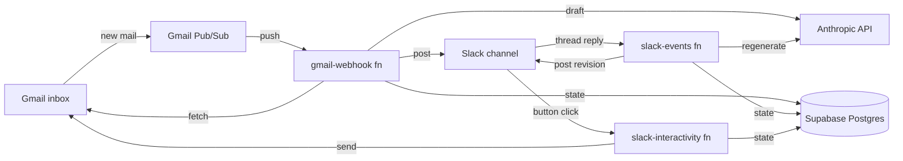

# PROMUNCH Email Agent

AI assistant that monitors `hello@promunch.in`, posts every new email to a Slack channel with a Claude-drafted reply, and waits for human approval. You can iterate on the draft by replying in the Slack thread; once you're happy, click **Approve & Send** (or type `approve` in the thread) and the reply ships in the original Gmail thread.

Built as a set of Supabase Edge Functions (Deno + TypeScript) calling Gmail, Slack, and the Anthropic API.

---

## How it works

1. A new email lands in `hello@promunch.in`.
2. Google sends a Pub/Sub push notification → `gmail-webhook` function fetches the message.
3. Claude drafts a reply using a ProMunch-aware system prompt.
4. `gmail-webhook` posts the email + draft + action buttons to your Slack channel.
5. You either:
   - **Click "Approve & Send"** → `slack-interactivity` calls Gmail's send API in the original thread.
   - **Reply in the Slack thread with feedback** ("make it shorter", "ask for the order ID", etc.) → `slack-events` regenerates the draft using your feedback and posts the new revision in the same thread.
   - **Click "Skip"** → the email is marked skipped, nothing is sent.
6. Every revision is stored in Postgres so you have a full audit trail.



---

## Project layout

```
promunch-email-agent/
├── README.md
├── slack-app-manifest.json          # paste into api.slack.com → create from manifest
├── .env.example
├── deno.json
└── supabase/
    ├── config.toml
    ├── migrations/
    │   └── 20260518000000_init.sql  # email_threads, draft_revisions, sent_replies, oauth_tokens
    └── functions/
        ├── _shared/
        │   ├── anthropic.ts          # Claude draft generation + ProMunch system prompt
        │   ├── approve.ts            # send-reply pipeline (used by button + "approve" command)
        │   ├── gmail.ts              # Gmail REST: OAuth refresh, history, get, send, watch
        │   ├── process-email.ts      # the new-email → draft → post-to-slack pipeline
        │   ├── slack.ts              # Slack API + signature verification + block builders
        │   ├── supabase.ts           # Postgres client (service role)
        │   └── types.ts
        ├── gmail-webhook/            # Pub/Sub push receiver
        ├── gmail-poll/               # cron fallback (every 2 min)
        ├── gmail-watch-renew/        # daily cron — keeps the Pub/Sub watch alive
        ├── slack-events/             # thread replies → regenerate
        ├── slack-interactivity/      # button clicks → approve/regenerate/skip
        └── oauth-callback/           # one-time OAuth bootstrap
```

---

## Setup

### 0. Prerequisites

- Supabase project (free tier is fine; ~1k emails/month is well within limits).
- Supabase CLI installed: `brew install supabase/tap/supabase`.
- A Google Cloud project with billing enabled (Pub/Sub requires billing, but stays in free tier at this volume).
- An Anthropic API key.
- Slack workspace where you have permission to install a custom app.

### 1. Clone + link the Supabase project

```bash
cd promunch-email-agent
supabase login
supabase link --project-ref <your-project-ref>
supabase db push                       # applies the migration
```

### 2. Google Cloud / Gmail setup

a. **Enable APIs** in the GCP console for your project:
   - Gmail API
   - Cloud Pub/Sub API

b. **Create the Pub/Sub topic + subscription**:
   ```bash
   gcloud pubsub topics create gmail-hello
   gcloud pubsub topics add-iam-policy-binding gmail-hello \
     --member=serviceAccount:gmail-api-push@system.gserviceaccount.com \
     --role=roles/pubsub.publisher
   gcloud pubsub subscriptions create gmail-hello-sub \
     --topic=gmail-hello \
     --push-endpoint="https://<your-project-ref>.supabase.co/functions/v1/gmail-webhook?token=<PUBSUB_VERIFICATION_TOKEN>"
   ```
   The `PUBSUB_VERIFICATION_TOKEN` is just a random string you generate; it goes into your env vars and into the push URL above.

c. **Create OAuth credentials** under APIs & Services → Credentials → Create Credentials → OAuth client ID:
   - Application type: **Web application**
   - Authorized redirect URI: `https://<your-project-ref>.supabase.co/functions/v1/oauth-callback`
   - Save the client ID and client secret into `.env`.

d. **Add `hello@promunch.in` as a test user** under OAuth consent screen → Test users (you can stay in "Testing" status as long as that single user is added).

### 3. Slack setup

a. Go to <https://api.slack.com/apps> → **Create New App** → **From an app manifest**.
b. Paste `slack-app-manifest.json` — first replace `REPLACE_WITH_YOUR_SUPABASE_PROJECT` in the two request URLs with your project ref.
c. Install the app to your workspace, copy the **Bot User OAuth Token** (`xoxb-…`) and **Signing Secret** into `.env`.
d. Run `curl -X POST https://slack.com/api/auth.test -H "Authorization: Bearer xoxb-..."` to get the bot's user ID (`U…`), put it in `SLACK_BOT_USER_ID`.
e. Create or pick the destination channel, invite the bot (`/invite @PROMUNCH Inbox`), then put the channel ID (right-click channel → View channel details → bottom) in `SLACK_CHANNEL_ID`.

### 4. Push env vars and deploy

```bash
cp .env.example .env
# fill in real values, then:
supabase secrets set --env-file .env

supabase functions deploy gmail-webhook
supabase functions deploy gmail-poll
supabase functions deploy gmail-watch-renew
supabase functions deploy slack-events
supabase functions deploy slack-interactivity
supabase functions deploy oauth-callback
```

### 5. Bootstrap OAuth (one-time, in a browser)

```
https://<project-ref>.supabase.co/functions/v1/oauth-callback?action=start&token=<SETUP_TOKEN>
```
Log in as `hello@promunch.in`, accept the scopes (gmail.modify + gmail.send). You'll get a "✅ OAuth complete" page when the refresh token is saved.

### 6. Start the Gmail watch

```bash
curl -X POST https://<project-ref>.supabase.co/functions/v1/gmail-watch-renew \
  -H "Authorization: Bearer $SUPABASE_ANON_KEY"
```

### 7. Schedule the cron jobs

```bash
# renew the Gmail watch daily (Gmail watches expire after 7 days)
supabase functions schedule create gmail-watch-renew "0 6 * * *"

# poll fallback every 2 min — only matters if Pub/Sub fails for any reason
supabase functions schedule create gmail-poll "*/2 * * * *"
```

### 8. Test it

Send an email to `hello@promunch.in` from another address. Within seconds you should see it appear in your Slack channel with a drafted reply and three buttons.

- Reply in the thread `make it shorter and skip the greeting` → bot posts a v2 draft.
- Reply in the thread `approve` → bot sends the v2 draft via Gmail.
- Or click **✅ Approve & Send** to send the current draft.

---

## Customizing the draft style

Edit the `SYSTEM_PROMPT` constant in `supabase/functions/_shared/anthropic.ts`. That's the entire personality and guardrails for the agent. Redeploy `slack-events`, `slack-interactivity`, `gmail-webhook`, and `gmail-poll` after changes.

If you want to give Claude tools (e.g., look up a Shopify order to answer "where is my order?"), swap the `messages.create` call in `anthropic.ts` for the [Claude Agent SDK](https://docs.claude.com/en/api/agent-sdk) with tool definitions. The rest of the system stays the same — only the draft-generation module changes.

---

## Operational notes

- **Idempotency.** `processIncomingMessage` checks `email_threads.gmail_message_id` and skips duplicates, so it's safe to run the webhook and the cron poll at the same time.
- **Multi-message threads.** If a customer keeps replying, each new message creates a new draft revision under the same Slack thread (not a new Slack post) — so the conversation stays in one place.
- **Failed sends** surface as a `:warning:` reply in the Slack thread; the thread stays in `pending` so you can fix the draft and try again.
- **Audit trail.** Every send is logged in `sent_replies` with the approving Slack user and the exact body that was sent.
- **Costs.** At under 1k emails/month and Claude Sonnet 4.6 for drafting (~1k input + 500 output tokens per email), you're looking at well under $10/month total across Supabase + Anthropic.

---

## Troubleshooting

- **Slack URL verification fails.** Make sure `verify_jwt = false` is set for `slack-events` in `supabase/config.toml` and that you've redeployed after changing it.
- **`No refresh token stored for hello@promunch.in`.** You skipped the OAuth bootstrap step — visit `/oauth-callback?action=start&token=…`.
- **Pub/Sub deliveries 401.** The Supabase function default requires a JWT. Either set `verify_jwt = false` (already done in `config.toml`) and redeploy, or have Pub/Sub send an auth header.
- **Drafts are too formal / too casual.** Edit `SYSTEM_PROMPT` in `_shared/anthropic.ts` — that's where the voice lives.
- **Want to test without affecting prod inbox?** Point `MAILBOX_EMAIL` at a sandbox Gmail account first.
