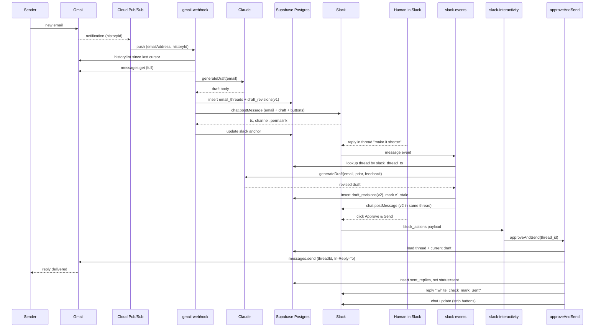

# Architecture

## Sequence — happy path



## State machine — email_thread.status

```
   pending ── approve ──▶ sent     (terminal)
       │
       ├── skip ────────▶ skipped  (terminal)
       │
       └── send fails ─▶ failed    (returns to pending after retry)
```

## Key design choices

- **No queue.** At <1k emails/month a queue would be overkill. Pub/Sub naturally retries the webhook on 5xx; the cron poll catches anything that fell through.
- **Single source of truth for state is Postgres.** Slack message ts and Gmail thread id are looked up there. If Slack and DB ever disagree (e.g., someone deletes the Slack message manually), the DB wins.
- **Revisions are append-only.** We never overwrite an old draft — we set `is_current=false` and insert a new row. This gives a full audit trail of how the human steered the AI.
- **Approval lives in two places** (button + "approve" thread reply) but both call the same `approveAndSend` function so behavior can't diverge.
- **Idempotency at the message level** (`unique(gmail_message_id)`) means we can re-trigger the webhook or run poll + push together without duplicate Slack posts.
- **Watch renewal is a separate function** because it's stateful in a different way — it talks to Gmail, not to a per-message workflow — and Gmail rate-limits watch() calls per project per day.

## Things deliberately left out (and where they'd go)

- **Per-customer context.** Today the draft only sees the incoming email. A natural next step is to give Claude a tool to look up the sender's Shopify order history. That tool would be defined in `_shared/anthropic.ts` and wired through the Anthropic SDK's tool-use API.
- **Multi-mailbox support.** The schema already keys on `email`, but `processIncomingMessage` assumes a single configured mailbox. Generalizing means promoting `MAILBOX_EMAIL` from env var to per-message routing.
- **Categorization / triage.** Right now every email gets a draft. A cheap classifier prepended to `generateDraft` could mark "marketing / out of office / actionable" and only draft the actionable ones.
- **Attachments.** Inbound attachments are ignored; outbound replies are plain text only. Both are solvable inside `gmail.ts`.
